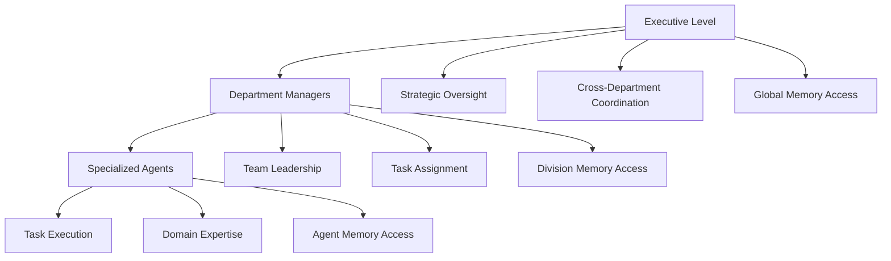
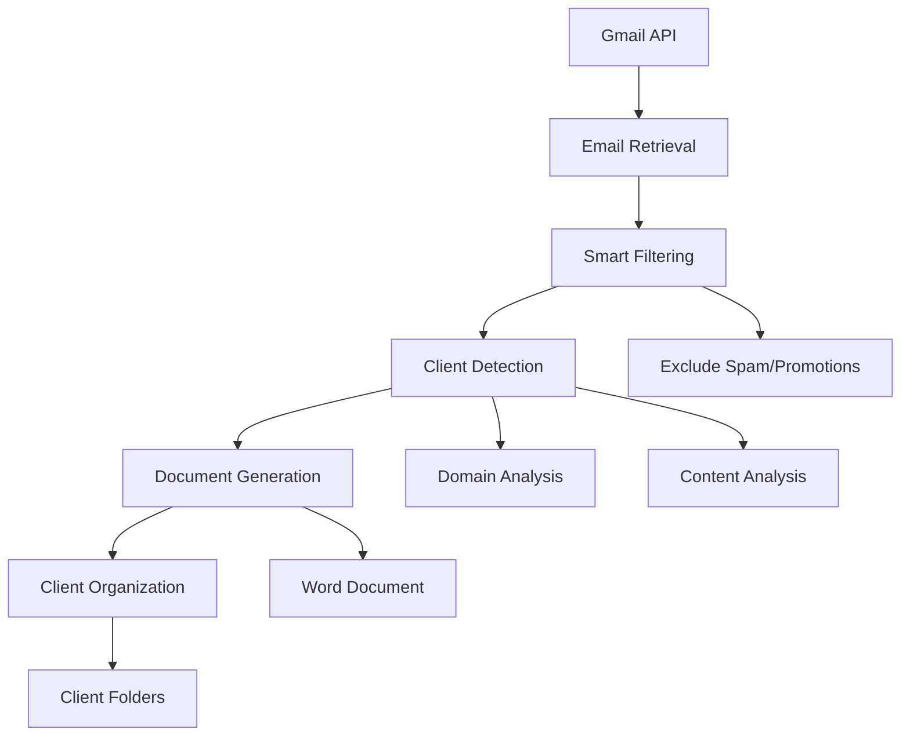

# 🚀 AI Multi-Agent Company System

A comprehensive multi-agent system powered by **Semantic Kernel** that implements a complete company structure with hierarchical agent management, role-based permissions, memory integration, and modular department architecture.

## 📖 **Table of Contents**
- [🎯 Overview & Key Features](#-overview--key-features)
- [🏗️ System Architecture](#️-system-architecture)
- [🚀 Quick Start](#-quick-start)
- [⚙️ Configuration](#️-configuration)
- [💾 Memory System](#-memory-system)
- [📧 Gmail Integration](#-gmail-integration)
- [🎭 Role-Based Access](#-role-based-access)
- [🏢 Modular Departments](#-modular-departments)
- [💻 Usage Examples](#-usage-examples)
- [🔧 Development Guide](#-development-guide)
- [📊 Monitoring & Analytics](#-monitoring--analytics)
- [🔍 Troubleshooting](#-troubleshooting)
- [📚 API Reference](#-api-reference)

---

## 🎯 **Overview & Key Features**

This system combines **role-based multi-agent architecture** with **modular department management** to create a scalable, enterprise-ready AI company structure.

### ✨ **Core Features**

| Feature | Description |
|---------|-------------|
| 🏢 **Modular Departments** | Auto-discovery system for easy department creation |
| 🎭 **Role-Based Access** | Executive, Manager, and Agent permission levels |
| 💾 **Memory Integration** | Persistent knowledge with Google Drive sync |
| 🔄 **Task Workflows** | Multi-level verification and approval processes |
| 🎯 **Smart Routing** | Semantic task routing to appropriate departments |
| 📊 **Real-Time Analytics** | Performance metrics and health monitoring |
| ⚡ **Auto-Discovery** | Departments auto-load via YAML configuration |
| 🔒 **Security** | Role-based memory access and permissions |

### 🎨 **System Highlights**

- **Template-Driven**: Add new departments with just 3 files
- **Enterprise-Ready**: Built for scale with proper access controls
- **Memory-Enhanced**: Agents have access to relevant company knowledge
- **Business-Friendly**: YAML configuration for non-technical users
- **Developer-Friendly**: Clean architecture with extensive documentation

---

## 🏗️ **System Architecture**

### 🎭 **Role-Based Hierarchy**



### 🏢 **Department Structure**

```
🏢 Company System
├── 📁 Executive/
│   ├── executive_agents.py      # Strategic leadership
│   ├── department.yaml          # Configuration
│   └── executive_agent.py       # CMO implementation
├── 📁 Marketing/
│   ├── marketing_department.py  # Department controller
│   ├── department.yaml          # Agent definitions
│   ├── content_marketing/agents/    # Content specialists
│   ├── digital_marketing/agents/    # Digital specialists
│   └── product_marketing/agents/    # Product specialists
└── 📁 [Future Departments]/
    ├── sales_department.py      # Auto-discovered
    ├── department.yaml          # YAML configuration
    └── agents/                  # Specialist agents
```

### 🔄 **Task Verification Flow**

```
User Input → Semantic Routing → Department Selection → Agent Assignment → Manager Review → Executive Approval → Final Output
```

1. **Smart Routing**: Semantic analysis routes tasks to appropriate departments
2. **Agent Execution**: Specialized agent completes the task with memory context
3. **Manager Review**: Department manager validates quality and completeness
4. **Executive Oversight**: Strategic review for important decisions
5. **Memory Storage**: Results stored for future reference

---

## 🚀 **Quick Start**

### 📋 **Prerequisites**

#### **Core System**
- **Python 3.8+**
- **Azure OpenAI** credentials (API key, endpoint, deployment)
- **Docker** (for Qdrant vector database)
- **Google Drive API** credentials (for memory system)

#### **Web Interface (Optional)**
- **Node.js 16+** and **npm** (for AgentUI web interface)
- Download from: https://nodejs.org/

### ⚡ **Installation**

```bash
# 1. Clone the repository
git clone <repository-url>
cd semantickernel-dt

# 2. Install Python dependencies
pip install -r requirements.txt

# 3. Install Node.js dependencies (for web interface)
cd AgentUI
npm install
cd ..

# 4. Start Qdrant database
docker run -d -p 6333:6333 --name qdrant-memory qdrant/qdrant

# 5. Configure environment
cp .env.example .env
# Edit .env with your credentials

# 6. Setup memory system (optional but recommended)
python Memory/gdrive_sync_cli.py setup --credentials Memory/Config/credentials.json --folder-id YOUR_FOLDER_ID

# 7. Run the system
python launcher.py  # Choose interface: Terminal or Web
# OR
python main.py      # Terminal interface only
```

### 🎯 **First Run**

```bash
# Option 1: Role-based terminal interface
python main.py

# Option 2: Direct company system
python -c "
from Core.company_system import CompanySystem
import semantic_kernel as sk
company = CompanySystem(sk.Kernel())
company.initialize_all_departments()
print('🎉 Company initialized!')
"
```

---

## ⚙️ **Configuration**

### 🔐 **Environment Variables**

Create a `.env` file with your configuration:

```env
# Azure OpenAI Configuration (Required)
AZURE_OPENAI_API_KEY=your_azure_openai_api_key_here
AZURE_OPENAI_ENDPOINT=https://your-resource.openai.azure.com/
AZURE_OPENAI_API_VERSION=2024-12-01-preview
AZURE_OPENAI_DEPLOYMENT_NAME=gpt-4o

# System Configuration
MAX_TOKENS=2000
TEMPERATURE=0.7
LOG_LEVEL=INFO
ENABLE_HUMAN_APPROVAL=true

# Gmail Integration (Optional)
GOOGLE_CLIENT_ID=your_client_id_here
GOOGLE_CLIENT_SECRET=your_client_secret_here
GOOGLE_PROJECT_ID=your_project_id_here

# Memory System (Optional)
GOOGLE_DRIVE_ROOT_FOLDER_ID=1ABC123DEF456GHI789
GOOGLE_DRIVE_CREDENTIALS_PATH=Memory/Config/credentials.json
GOOGLE_DRIVE_TOKEN_PATH=Authentication/token.json
QDRANT_HOST=localhost
QDRANT_PORT=6333

# Workflow Configuration
AUTO_RETRY_FAILED_TASKS=true
MAX_RETRY_ATTEMPTS=3
```

### 📋 **Department Configuration**

Each department uses a `department.yaml` file:

```yaml
# Example: Departments/Sales/department.yaml
display_name: "Sales"
description: "Sales department with lead generation and conversion"
memory_collection: "sales-memory"

skills:
  - "Lead Generation"
  - "Sales Conversion"
  - "Pipeline Management"

routing_keywords:
  - "sales"
  - "leads"
  - "pipeline"
  - "conversion"

agents:
  - name: "LeadAgent"
    class: "LeadAgent"
    file: "agents/lead_agent.py"
    specialization: "lead_generation"
```

---

## 💾 **Memory System**

### 🧠 **Overview**

The memory system provides agents with persistent knowledge through:
- **Google Drive Integration**: Automatic document synchronization
- **Vector Search**: Semantic search using Qdrant database
- **Role-Based Access**: Different memory collections for different roles
- **Real-Time Updates**: Background sync keeps knowledge current

### 🔧 **Setup Memory System**

#### 1. **Start Qdrant Database**
```bash
docker run -d -p 6333:6333 --name qdrant-memory qdrant/qdrant
```

#### 2. **Google Drive Setup**
1. Create Google Cloud Project
2. Enable Google Drive API
3. Create OAuth 2.0 credentials
4. Download `credentials.json` to `Memory/Config/` directory

#### 3. **Prepare Drive Folder Structure**
```
📁 AI_Agent_Memory/
├── 📄 company_policies.pdf      # → Global shared knowledge
├── 📁 Marketing/                # → Marketing department
│   ├── 📄 brand_guidelines.pdf
│   └── 📄 campaign_data.docx
├── 📁 Sales/                    # → Sales department  
│   ├── 📄 sales_playbook.pdf
│   └── 📄 lead_data.xlsx
└── 📁 Executive/                # → Executive private files
    └── 📄 financial_reports.pdf
```

#### 4. **Initialize Memory System**
```bash
# Setup with your Google Drive folder ID
python Memory/gdrive_sync_cli.py setup --credentials Memory/Config/credentials.json --folder-id 1ABC123DEF456GHI789

# Initial sync
python Memory/gdrive_sync_cli.py sync --force

# Start background monitoring
python Memory/gdrive_sync_cli.py watch
```

### 🚀 **Running the System**

#### **Method 1: With Background Sync (Recommended)**
```bash
# Start background memory sync monitoring
python Memory/gdrive_sync_cli.py watch

# In another terminal, run your agents
python main.py
```

#### **Method 2: With Manual Sync**
```bash
# Sync before running agents (optional)
python Memory/gdrive_sync_cli.py sync

# Run your agents
python main.py
```

### 🔍 **Memory Collections**

| Collection | Access | Purpose |
|------------|--------|---------|
| `global-shared-memory` | All agents | Company-wide knowledge |
| `marketing-memory` | Marketing agents | Department-specific data |
| `sales-memory` | Sales agents | Sales processes and data |
| `executive-memory` | Executive only | Strategic information |

---

## 📧 **Gmail Integration**

### 🌟 **Overview**

The Gmail integration provides comprehensive email processing capabilities, automatically syncing business emails and converting them into organized Word documents. This system is designed to be future-proof, supporting Google Workspace expansion including Calendar and Drive integrations.

### ✨ **Core Features**

| Feature | Description |
|---------|-------------|
| 🔐 **OAuth2 Authentication** | Secure Gmail access with Google OAuth2 |
| 🎯 **Smart Email Filtering** | Automatically filters business-relevant emails |
| 🏢 **Client Detection** | Identifies which client emails belong to based on domain/content |
| 📄 **Document Generation** | Converts emails to structured Word documents |
| 📁 **Client Organization** | Automatically organizes documents by client folders |
| 🔮 **Future-Proof** | Designed to support Calendar and Drive integrations |

### 🚀 **Quick Setup**

#### 1. **Google Cloud Console Setup**
```bash
# 1. Go to Google Cloud Console (https://console.cloud.google.com/)
# 2. Create/select project
# 3. Enable APIs:
#    - Gmail API
#    - Google Calendar API (for future use)
#    - Google Drive API (for future use)
# 4. Create OAuth2 credentials:
#    - Application type: Web application
#    - Redirect URI: http://localhost:3001/auth/gmail/callback
```

#### 2. **Environment Configuration**
Add to your `.env` file:
```env
# Google OAuth2 Configuration
GOOGLE_CLIENT_ID=your_client_id_here
GOOGLE_CLIENT_SECRET=your_client_secret_here
GOOGLE_PROJECT_ID=your_project_id_here
```

#### 3. **Database Setup**
```bash
# Run the Gmail integration database migration
psql -h your_host -U your_user -d your_database -f gmail_migrations.sql
```

#### 4. **Test Integration**
```bash
# Run the comprehensive test suite
python Gmail/test_integration.py
```

### 💻 **Using Gmail Integration**

#### **Via Web Interface**
1. **Access Settings**: Click Settings button in any dashboard
2. **Connect Gmail**: Click "Connect Gmail" in the Gmail Integration section
3. **OAuth Flow**: Complete Google authorization
4. **Sync Emails**: Use "Sync Emails" to process recent emails
5. **View Documents**: Check client folders for generated documents

#### **Via API**
```python
# Get Gmail status
response = requests.get(
    "http://localhost:8000/api/gmail/status",
    params={"user_id": "user123"}
)

# Sync emails
response = requests.post(
    "http://localhost:8000/api/gmail/sync",
    json={
        "user_id": "user123",
        "days_back": 7,
        "max_results": 50
    }
)
```

### 📊 **API Endpoints**

| Endpoint | Method | Description |
|----------|--------|-------------|
| `/api/gmail/auth-url` | GET | Get OAuth2 authorization URL |
| `/api/gmail/callback` | POST | Handle OAuth2 callback |
| `/api/gmail/status` | GET | Get connection status |
| `/api/gmail/disconnect` | POST | Disconnect Gmail |
| `/api/gmail/sync` | POST | Sync and process emails |
| `/api/gmail/statistics` | GET | Get sync statistics |
| `/api/gmail/clients` | GET | Get client document summary |

### 🔄 **Email Processing Pipeline**



1. **Email Retrieval**: Fetches emails using Gmail API with filters
2. **Smart Filtering**: Excludes spam, promotions, newsletters, marketing
3. **Client Detection**: Identifies clients based on:
   - Sender domain (e.g., @amazon.com → Amazon)
   - Content keywords and patterns
   - Known business domains
4. **Document Generation**: Creates Word documents with:
   - Email metadata (sender, subject, date)
   - Cleaned email content
   - Client information
5. **Client Organization**: Stores documents in client-specific folders

### 📁 **Document Organization**

Generated documents are automatically organized:
```
Clients/
├── Amazon/
│   ├── 2025-01-28-abc12345-project-discussion.docx
│   └── 2025-01-27-def67890-meeting-notes.docx
├── Microsoft/
│   ├── 2025-01-28-ghi11111-contract-review.docx
└── Google/
    └── 2025-01-27-jkl22222-collaboration-proposal.docx
```

### 🔐 **Security & Privacy**

- **OAuth2 Security**: Standard Google authentication
- **Token Encryption**: Secure database storage with row-level security
- **Automatic Token Refresh**: Handles expired credentials
- **CSRF Protection**: State parameter validation
- **Data Privacy**: Only business-relevant emails are processed

### 🎯 **Business Email Filtering**

**Excluded Content**:
- Gmail labels: SPAM, TRASH, CATEGORY_PROMOTIONS, etc.
- Marketing patterns: unsubscribe links, no-reply addresses
- Newsletter content and promotional language

**Business Relevance Criteria**:
- Known business domains
- Business keywords (meeting, proposal, contract, etc.)
- Direct correspondence patterns

### 🔧 **Configuration Options**

```python
# Customize business domains in gmail_service.py
BUSINESS_DOMAINS = {
    'amazon.com': 'Amazon',
    'microsoft.com': 'Microsoft',
    'your-client.com': 'Your Client Name',
    # Add more domains as needed
}

# Customize filtering patterns
MARKETING_PATTERNS = [
    r'unsubscribe',
    r'marketing@',
    r'newsletter@',
    # Add more patterns as needed
]
```

### 🔮 **Future Roadmap**

The Gmail integration is designed for Google Workspace expansion:
- **Google Calendar**: Meeting sync and scheduling
- **Google Drive**: Document collaboration
- **Google Contacts**: Client relationship management
- **Advanced AI**: ML-based client detection
- **Real-time Notifications**: Instant email processing

---

## 🎭 **Role-Based Access**

### 👑 **Executive Level (CMO)**

**Access**: Global company data and strategic oversight

**Capabilities**:
- Strategic analysis with real financial data
- Cross-department coordination and oversight  
- High-priority task creation for any department
- Final approval authority for major decisions

**Memory Access**: `global-shared-memory` + all department collections

**Commands**:
```bash
CREATE TASK [department] [description]  # Create tasks
ANALYZE [topic]                         # Strategic analysis
VIEW TASKS                              # Executive dashboard
COORDINATE [departments]                # Cross-department projects
```

### 👔 **Manager Level (Department Leaders)**

**Access**: Division oversight and team management

**Capabilities**:
- Department team coordination
- Task assignment within division
- Performance monitoring and reporting
- Resource allocation and planning

**Memory Access**: `global-shared-memory` + department collection

**Commands**:
```bash
ASSIGN TASK [agent] [description]       # Assign to team members
VIEW TEAM                               # Department status
REVIEW SUBMISSIONS                      # Approve agent work
GUIDE [agent] [feedback]                # Provide guidance
```

### 🤖 **Agent Level (Specialists)**

**Access**: Task execution with domain expertise

**Capabilities**:
- Specialized task execution
- Memory-enhanced responses with context
- Task progress tracking and updates
- Collaboration with team members

**Memory Access**: `global-shared-memory` + agent collection

**Commands**:
```bash
VIEW MY TASKS                           # Personal task list
UPDATE TASK [id] [status]               # Update progress
ASK CLARIFICATION [question]            # Get guidance
SUBMIT WORK [description]               # Submit for review
```

### 🔐 **Account System**

Pre-configured test accounts:

```python
# Executive
"cmo" → ExecutiveAgent (global access)

# Managers  
"marketing_manager" → Marketing department oversight
"sales_manager" → Sales department oversight

# Agents
"seo_agent" → Digital marketing specialist
"content_agent" → Content creation specialist
"lead_agent" → Sales lead generation
```

---

## 🏢 **Modular Departments**

### ⚡ **Easy Department Creation**

Adding a new department requires just **3 simple steps**:

#### 1. **Copy Templates**
```bash
cp -r Core/Templates/ Departments/Sales/
cd Departments/Sales/
mv new_department_example.py sales_department.py
mv department_config.yaml.template department.yaml
```

#### 2. **Customize Department File**
```python
# sales_department.py
class SalesDepartment(BaseDepartment):
    def __init__(self, kernel: sk.Kernel):
        super().__init__("Sales", kernel)
        
    def setup_department(self) -> bool:
        # Your department-specific setup
        return True
```

#### 3. **Configure YAML**
```yaml
# department.yaml
display_name: "Sales"
description: "Sales department with lead generation"
routing_keywords: ["sales", "leads", "pipeline"]
agents:
  - name: "LeadAgent"
    class: "LeadAgent"
    file: "agents/lead_agent.py"
```

**Result**: System automatically discovers and loads your department! 🎉

### 🎯 **Department Auto-Discovery**

The system automatically finds departments by looking for:
1. `{department_name}_department.py` OR `{department_name}_agents.py`
2. `department.yaml` configuration file
3. Class name: `{DepartmentName}Department` OR `{DepartmentName}Agents`

### 📁 **Agent Organization**

Agents can be organized in specialized folders:

```
Departments/Marketing/
├── content_marketing/agents/
│   ├── brand_agent.py
│   ├── content_agent.py
│   └── social_agent.py
├── digital_marketing/agents/
│   ├── seo_agent.py
│   └── analytics_agent.py
└── product_marketing/agents/
    ├── positioning_agent.py
    └── competitor_agent.py
```

---

## 💻 **Usage Examples**

### 🎭 **Role-Based Terminal Interface**

```bash
python main.py
```

**Login as Executive:**
```
👤 Enter username: cmo
✅ Login successful!
Account Type: EXECUTIVE

[EXECUTIVE] 💬 Analyze our Q4 performance using latest financial data
```
→ Routes to ExecutiveAgent with global memory access

**Login as Manager:**
```
👤 Enter username: marketing_manager  
✅ Login successful!
Account Type: MANAGER

[MANAGER] 💬 ASSIGN TASK content_agent Create brand guidelines for new product
```
→ Creates task within Marketing department

**Login as Agent:**
```
👤 Enter username: seo_agent
✅ Login successful!
Account Type: AGENT

[AGENT] 💬 VIEW MY TASKS
```
→ Shows current assigned tasks

### 🏢 **Company System Direct Usage**

```python
from Core.company_system import CompanySystem
import semantic_kernel as sk

# Initialize system
kernel = sk.Kernel()
company = CompanySystem(kernel)

# Load all departments
success = company.initialize_all_departments()
print(f"Initialized: {success}")

# Get company dashboard
dashboard = company.get_company_dashboard()
print(f"Departments: {dashboard['system_status']['total_departments']}")
print(f"Total Agents: {dashboard['company_metrics']['total_agents']}")
print(f"Health Score: {dashboard['system_status']['health_score']}%")

# Route a task
task = "Create a social media campaign for our new product"
dept_name = company.route_task_to_department(task)
print(f"Task routed to: {dept_name}")  # → "Marketing"

# Get specific department
marketing = company.get_department("Marketing")
if marketing:
    info = marketing.get_info()
    print(f"Marketing has {len(info['agents'])} agents")
```

### 🔍 **Memory-Enhanced Queries**

```python
from Memory.enhanced_memory import EnhancedMemoryManager

# Initialize memory
memory = EnhancedMemoryManager()

# Search company knowledge
results = memory.search_memories(
    "brand guidelines", 
    collection_name="marketing-memory",
    limit=3
)

for result in results:
    print(f"Document: {result['metadata']['filename']}")
    print(f"Content: {result['text'][:200]}...")
```

---

## 🔧 **Development Guide**

### 🏗️ **Creating Custom Agents**

```python
from Core.agent import Agent, AgentType
import semantic_kernel as sk

class CustomAgent(Agent):
    def __init__(self, kernel: sk.Kernel):
        super().__init__(
            name="CustomAgent",
            role="Custom Specialist", 
            agent_type=AgentType.AUTONOMOUS,
            kernel=kernel,
            skills=["Custom Skill", "Domain Expertise"]
        )
    
    async def execute_task(self, task) -> bool:
        # Your custom logic here
        try:
            # Memory-enhanced processing
            context = await self.get_relevant_memories(task.description)
            
            # AI processing with context
            response = await self.process_with_ai(task.description, context)
            
            # Store result
            task.output = response
            task.update_status(TaskStatus.COMPLETED, self.name, "Task completed successfully")
            
            return True
        except Exception as e:
            task.update_status(TaskStatus.FAILED, self.name, f"Error: {str(e)}")
            return False
```

### 📊 **Department Health Monitoring**

```python
class CustomDepartment(BaseDepartment):
    def health_check(self) -> bool:
        base_health = super().health_check()
        
        # Custom health checks
        api_healthy = self.check_external_api()
        data_current = self.check_data_freshness()
        
        return base_health and api_healthy and data_current
    
    def get_department_metrics(self) -> Dict[str, Any]:
        return {
            "total_tasks_today": self.count_daily_tasks(),
            "avg_response_time": self.calculate_avg_response_time(),
            "success_rate": self.calculate_success_rate(),
            "custom_metric": self.get_custom_metric()
        }
```

### 🔄 **Custom Workflows**

```python
def _setup_workflows(self):
    self.workflows = {
        "urgent_escalation": {
            "steps": ["immediate_action", "notify_manager", "executive_alert"],
            "agents_involved": ["specialist_agent", "manager", "executive"],
            "max_duration": "1_hour"
        },
        "standard_process": {
            "steps": ["analysis", "execution", "review", "approval"],
            "agents_involved": ["analyst", "executor", "reviewer"],
            "max_duration": "1_day"
        }
    }
```

---

## 📊 **Monitoring & Analytics**

### 🎯 **Real-Time Dashboard**

```python
# Get comprehensive system status
dashboard = company.get_company_dashboard()

# System health
print(f"🏥 Health Score: {dashboard['system_status']['health_score']}%")
print(f"🏢 Departments: {dashboard['system_status']['total_departments']}")

# Department breakdown
for dept_name, dept_info in dashboard['departments'].items():
    status = "✅" if dept_info['health'] else "❌"
    print(f"{status} {dept_name}: {dept_info['agents']} agents")
```

### 📈 **Performance Metrics**

| Metric | Description | Access |
|--------|-------------|---------|
| **Task Completion Rate** | % of tasks completed successfully | `department.get_metrics()` |
| **Response Time** | Average time to complete tasks | `agent.get_performance()` |
| **Memory Utilization** | Knowledge base usage statistics | `memory.get_stats()` |
| **Department Health** | Overall system health score | `company.get_health_score()` |

### 🔍 **Logging & Monitoring**

```python
import logging

# Configure detailed logging
logging.basicConfig(
    level=logging.INFO,
    format='%(asctime)s - %(name)s - %(levelname)s - %(message)s',
    handlers=[
        logging.FileHandler('company_system.log'),
        logging.StreamHandler()
    ]
)

# Department-specific logs
logger = logging.getLogger('Marketing.ContentAgent')
logger.info("Task completed successfully")
```

---

## 🔍 **Troubleshooting**

### ❌ **Common Issues**

#### **Department Not Discovered**
```bash
# Check file naming
ls Departments/YourDept/
# Expected: your_dept_department.py or your_dept_agents.py
# Expected: department.yaml

# Check class name
grep "class.*Department\|class.*Agents" Departments/YourDept/*.py
```

#### **Gmail Integration Issues**
```bash
# Test Gmail integration setup
python Gmail/test_integration.py

# Check Gmail API endpoints
curl -s 'http://localhost:8000/api/gmail/status?user_id=test123'
# Expected: {"connected":false,"error":null}

# Test OAuth URL generation
curl -s 'http://localhost:8000/api/gmail/auth-url?user_id=test123'
# Expected: {"success":true,"auth_url":"https://accounts.google.com/..."}

# Check Google configuration
python -c "
from Utils.config import Config
config = Config.get_google_config()
print('Client ID configured:', bool(config.get('client_id')))
print('Client Secret configured:', bool(config.get('client_secret')))
"
```

#### **Memory System Issues**
```bash
# Check Qdrant is running
curl http://localhost:6333/health
# Expected: {"status":"ok"}

# Check Google Drive sync
python Memory/gdrive_sync_cli.py status

# Test memory search
python -c "
from Memory.enhanced_memory import EnhancedMemoryManager
memory = EnhancedMemoryManager()
print(memory.get_collection_info('global-shared-memory'))
"
```

#### **Agent Import Errors**
```bash
# Check Python path
python -c "
import sys
print('\\n'.join(sys.path))
"

# Test agent import
python -c "
from Departments.Marketing.content_marketing.agents.content_agent import ContentAgent
print('✅ Import successful')
"
```

### 🔧 **Debug Mode**

```python
import logging
logging.basicConfig(level=logging.DEBUG)

# Enable detailed company system logging
company = CompanySystem(kernel)
company.initialize_all_departments()
# Will show detailed loading information
```

### 📞 **Getting Help**

1. **Check logs**: `tail -f company_system.log`
2. **Verify configuration**: Review `.env` and `department.yaml` files
3. **Test components**: Run individual component tests
4. **Health checks**: Use built-in health monitoring

---

## 📚 **API Reference**

### 🏢 **CompanySystem**

```python
class CompanySystem:
    def __init__(self, kernel: sk.Kernel)
    def initialize_all_departments() -> bool
    def get_department(dept_name: str) -> Optional[BaseDepartment]
    def route_task_to_department(description: str) -> Optional[str]
    def get_company_dashboard() -> Dict[str, Any]
    def get_company_health_score() -> float
    def shutdown_all_departments()
```

### 🏗️ **BaseDepartment**

```python
class BaseDepartment(ABC):
    def __init__(self, department_name: str, kernel: sk.Kernel)
    @abstractmethod
    def setup_department(self) -> bool
    def initialize() -> bool
    def get_info() -> Dict[str, Any]
    def health_check() -> bool
    def shutdown()
```

### 🤖 **Agent**

```python
class Agent:
    def __init__(self, name: str, role: str, agent_type: AgentType, kernel: sk.Kernel)
    async def execute_task(self, task: Task) -> bool
    async def get_relevant_memories(self, query: str) -> List[str]
    def get_performance_metrics() -> Dict[str, Any]
```

### 💾 **EnhancedMemoryManager**

```python
class EnhancedMemoryManager:
    def search_memories(self, query: str, collection_name: str, limit: int) -> List[Dict]
    def store_memory(self, text: str, metadata: Dict, collection_name: str)
    def get_collection_info(self, collection_name: str) -> Dict
    def get_agent_memory_collection(self, agent_name: str) -> str
```

### 📧 **GmailIntegrationManager**

```python
class GmailIntegrationManager:
    def get_auth_url(self, user_id: str) -> Optional[str]
    def complete_oauth_flow(self, user_id: str, authorization_code: str, state: str) -> Dict[str, Any]
    def get_connection_status(self, user_id: str) -> Dict[str, Any]
    def disconnect_gmail(self, user_id: str) -> Dict[str, Any]
    def sync_emails(self, user_id: str, days_back: int, max_results: int) -> Dict[str, Any]
    def get_sync_statistics(self, user_id: str, days_back: int) -> Dict[str, Any]
```

### 📄 **DocumentService**

```python
class DocumentService:
    def process_emails_to_documents(self, emails: List[EmailData]) -> Dict[str, Any]
    def create_email_document(self, email: EmailData) -> Optional[Path]
    def get_client_summary(self) -> Dict[str, Any]
    def cleanup_old_documents(self, days_old: int) -> Dict[str, Any]
```

---

## 🎉 **Conclusion**

This system provides a **complete AI company infrastructure** with:

✅ **Enterprise-Ready Architecture**: Role-based access, proper security, scalable design  
✅ **Business-Friendly**: YAML configuration, easy department creation  
✅ **Developer-Friendly**: Clean code, extensive documentation, modular design  
✅ **Memory-Enhanced**: Persistent knowledge with automatic synchronization  
✅ **Gmail Integration**: Automatic email processing and document generation  
✅ **Production-Ready**: Health monitoring, error handling, comprehensive logging  

**Getting started is as simple as:**
1. **Install** dependencies and start Qdrant
2. **Configure** your `.env` file with API credentials  
3. **Run** `python main.py` and start interacting!

The modular system makes it incredibly easy to expand your AI company with new departments while maintaining consistency, security, and reliability! 🚀

---

*Built with ❤️ using Semantic Kernel, Azure OpenAI, Qdrant, Google Drive API, and Gmail API*
